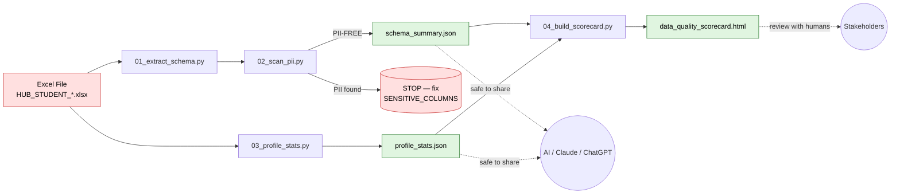

# Data Profiling Workflow

[](https://www.python.org/downloads/)
[](LICENSE)
[](#why-this-exists--ทำไมต้องมี)
[](https://www.kmutt.ac.th/)

> Workflow สำหรับ **ดึงโครงสร้างและสถิติ** จากข้อมูลดิบของมหาวิทยาลัย (เช่น ทะเบียนนักศึกษา) ให้ออกมาเป็นไฟล์ที่ **แชร์กับ AI ได้อย่างปลอดภัยตาม PDPA** โดยไม่มี row-level data หลุดออกไป
>
> A reproducible pipeline that converts a raw university spreadsheet into a sharable **schema summary + aggregated profile** so analysts can collaborate with LLMs (Claude, ChatGPT) without leaking personal data. Includes built-in PII scanning and k-anonymity suppression.

---

## ทำไมต้องมี · Why this exists

นักวิเคราะห์ในมหาวิทยาลัยมักอยากให้ AI ช่วยเขียน SQL หรือออกแบบ dashboard แต่ข้อมูลนักศึกษาเป็น **personal data** ภายใต้ พ.ร.บ.คุ้มครองข้อมูลส่วนบุคคล พ.ศ. 2562 (PDPA) — ส่งไฟล์ดิบให้ AI ภายนอกไม่ได้

repo นี้สร้าง **สิ่งทดแทนข้อมูลดิบ** 3 อย่างที่ปลอดภัย:

| Output | สิ่งที่มี | ใช้ทำอะไร |
|--------|---------|----------|
| `schema_summary.json` | ชื่อคอลัมน์, ชนิด, null%, unique count, top-5 values (k-anonymized) | บอก AI ว่าตารางหน้าตาเป็นยังไง |
| `profile_stats.json` | สถิติเชิงตัวเลข + distribution (count ≥ k) | บอก AI ว่าข้อมูลเชิงปริมาณเป็นยังไง |
| `data_quality_scorecard.html` | เกรดคุณภาพข้อมูลรายคอลัมน์ | รายงานให้มนุษย์ (ผู้บริหาร) ดู |

ไม่มีไฟล์ไหนใน 3 ตัวนี้มีค่าระดับบุคคล (row-level value) เหลืออยู่

---

## Quick Start

ติดตั้งและรันทั้ง pipeline ใน 4 คำสั่ง:

```bash
pip install -r requirements.txt
python scripts/01_extract_schema.py --input data/your_file.xlsx --output outputs/schema.json
python scripts/02_scan_pii.py       --input outputs/schema.json --report outputs/pii_report.txt --strict
python scripts/03_profile_stats.py  --input data/your_file.xlsx --output outputs/profile.json
python scripts/04_build_scorecard.py --schema outputs/schema.json --profile outputs/profile.json --output outputs/scorecard.html
```

> **หมายเหตุ:** วาง `your_file.xlsx` ไว้ที่ `data/` ก่อน — โฟลเดอร์นี้อยู่ใน `.gitignore` แล้ว ป้องกัน commit เผลอ

---

## Workflow Diagram



🟥 = ห้ามแชร์ออกนอกองค์กร · 🟩 = ปลอดภัยสำหรับการแชร์ (หลังผ่าน PII scan)

---

## Repo Structure

```
.
├── README.md                            # ไฟล์นี้
├── LICENSE                              # MIT
├── requirements.txt                     # duckdb, pandas, openpyxl
├── .gitignore                           # block data/, *.xlsx, *.csv
├── docs/
│   ├── tutorial.md                      # tutorial ฉบับเต็ม (ภาษาไทย)
│   ├── tutorial.docx                    # ต้นฉบับสำหรับ download
│   └── images/                          # screenshots (ถ้ามี)
├── scripts/
│   ├── 01_extract_schema.py             # → schema_summary.json
│   ├── 02_scan_pii.py                   # → pii_report.txt
│   ├── 03_profile_stats.py              # → profile_stats.json
│   └── 04_build_scorecard.py            # → scorecard.html
├── examples/
│   ├── sample_schema_summary.json       # ตัวอย่าง output (synthetic)
│   └── sample_data_quality_scorecard.html
└── .github/
    ├── workflows/
    │   └── pii-check.yml                # block PR ที่มี PII patterns
    └── scripts/
        └── scan_committed_files.py      # regex scanner ที่ CI เรียกใช้
```

---

## เอกสาร · Documentation

- **[Tutorial ฉบับเต็ม (ภาษาไทย)](docs/tutorial.md)** — อธิบายแนวคิด PDPA, k-anonymity, การใช้ DuckDB, การส่งผลให้ AI
- **[ต้นฉบับ .docx](docs/tutorial.docx)** — สำหรับ download ไปอ่าน offline

---

## Security & PDPA Notes

- ✅ `outputs/` ทั้งหมดต้องผ่าน `02_scan_pii.py --strict` ก่อนแชร์
- ✅ k-anonymity threshold default = 5 (ปรับด้วย `--suppress-threshold`)
- ✅ คอลัมน์ identifier ทุกตัวอยู่ใน `SENSITIVE_COLUMNS` — ดึงเฉพาะ metadata, ไม่ดึง top values
- ✅ GitHub Actions มี `pii-check.yml` block commit ที่มี citizen ID / phone / email
- ❌ **ห้าม** commit ไฟล์ `.xlsx`, `.csv`, หรือ output JSON จากข้อมูลจริง — `.gitignore` ป้องกันไว้แล้ว แต่ตรวจซ้ำก่อน push ทุกครั้ง

---

## Contributing

ยินดีรับ PR — กรุณา:

1. **อย่า commit ข้อมูลจริง** ของนักศึกษา ใช้ synthetic data เท่านั้นในตัวอย่าง
2. รัน `python scripts/02_scan_pii.py --strict` กับ JSON ที่สร้างใหม่ก่อน commit
3. ใช้ [Conventional Commits](https://www.conventionalcommits.org/) — `feat:`, `fix:`, `docs:`, `chore:` เป็นต้น
4. ทดสอบ `python scripts/<each>.py --help` หลังแก้ argparse interface
5. ถ้าเพิ่ม PII pattern ใหม่ ให้ใส่ทั้งใน `02_scan_pii.py` และ `.github/scripts/scan_committed_files.py`

ติดปัญหา → เปิด [issue](../../issues) พร้อม minimal repro

---

## License

[MIT](LICENSE) © 2026 KMUTT Strategy Office (สำนักงานยุทธศาสตร์ มหาวิทยาลัยเทคโนโลยีพระจอมเกล้าธนบุรี)
