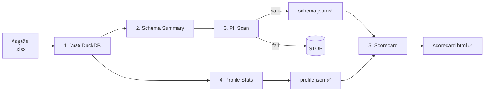

# การดึงโครงสร้างจากข้อมูลดิบ

**Schema & Profile Extraction Workflow**
สำหรับการเตรียมข้อมูลให้ปลอดภัยตาม PDPA ก่อนใช้งานร่วมกับ AI

> สำนักงานยุทธศาสตร์ (สนย.) — มหาวิทยาลัยเทคโนโลยีพระจอมเกล้าธนบุรี
> Version 1.0

---

## สารบัญ

1. [ทำไมต้องดึงโครงสร้างจากข้อมูลดิบ](#1-ทำไมต้องดึงโครงสร้างจากข้อมูลดิบ)
2. [ภาพรวม Workflow](#2-ภาพรวม-workflow)
3. [การเตรียมสภาพแวดล้อม (Environment)](#3-การเตรียมสภาพแวดล้อม-environment)
4. [ขั้นตอนที่ 1: โหลดข้อมูลด้วย DuckDB](#4-ขั้นตอนที่-1-โหลดข้อมูลด้วย-duckdb)
5. [ขั้นตอนที่ 2: สร้าง Schema Summary](#5-ขั้นตอนที่-2-สร้าง-schema-summary)
6. [ขั้นตอนที่ 3: ตรวจสอบ PII](#6-ขั้นตอนที่-3-ตรวจสอบ-pii)
7. [ขั้นตอนที่ 4: สร้าง Profile Statistics](#7-ขั้นตอนที่-4-สร้าง-profile-statistics)
8. [ขั้นตอนที่ 5: สร้าง Data Quality Scorecard](#8-ขั้นตอนที่-5-สร้าง-data-quality-scorecard)
9. [วิธีนำผลไปใช้กับ AI](#9-วิธีนำผลไปใช้กับ-ai)
10. [ข้อควรระวัง (Pitfalls)](#10-ข้อควรระวัง-pitfalls)
11. [ภาคผนวก](#11-ภาคผนวก)

---

## 1. ทำไมต้องดึงโครงสร้างจากข้อมูลดิบ

ในการทำงานวิเคราะห์ข้อมูลร่วมกับเครื่องมือ AI (เช่น Claude, ChatGPT) เรามักต้องการให้ AI ช่วยเขียน SQL, ออกแบบ dashboard, หรือเสนอวิธีวิเคราะห์ แต่ข้อมูลนักศึกษาเป็น **personal data** (ข้อมูลส่วนบุคคล) ภายใต้ **พ.ร.บ.คุ้มครองข้อมูลส่วนบุคคล พ.ศ. 2562 (PDPA)** จึงไม่สามารถส่งข้อมูลดิบออกไปยังบริการภายนอกได้

ทางออกคือการสร้าง **“สิ่งทดแทนข้อมูลดิบ”** ที่ปลอดภัย ได้แก่:

- **Schema Summary** — รายชื่อคอลัมน์ ชนิดข้อมูล จำนวน null/unique
- **Aggregated Statistics** — สถิติรวม เช่น min/max/mean โดยไม่มีค่าระดับบุคคล
- **Top-N Values** — ค่ายอดนิยมของแต่ละคอลัมน์ (เฉพาะที่ไม่ระบุตัวบุคคล)

สามสิ่งนี้รวมกันเรียกว่า **data profile** (โปรไฟล์ข้อมูล) ใช้แทนข้อมูลดิบในการสื่อสารกับ AI ได้ และปลอดภัยตาม PDPA

> ⚠ **ข้อควรจำ**
> การลบคอลัมน์ระบุตัวบุคคล (เช่น `STUDENT_CODE`) เพียงอย่างเดียว **ไม่เพียงพอ** — ข้อมูลรวม (combination) ของคอลัมน์อื่นยังอาจระบุตัวบุคคลได้ทางอ้อม (re-identification) เอกสารฉบับนี้สอนการสร้าง schema และ profile ที่ไม่มีข้อมูลระดับบุคคล (row-level) จึงปลอดภัยจากความเสี่ยงนี้

---

## 2. ภาพรวม Workflow

กระบวนการทำงานทั้งหมดมี 5 ขั้นตอน ดังนี้:

| ขั้นตอน | สิ่งที่ได้ | ใช้สำหรับ |
| --- | --- | --- |
| 1. โหลดข้อมูลดิบ | DuckDB table ในหน่วยความจำ | เตรียมข้อมูลให้พร้อม query |
| 2. สร้าง Schema Summary | `schema_summary.json` | บอกโครงสร้างให้ AI |
| 3. ตรวจ PII | `pii_scan_report.txt` | ยืนยันความปลอดภัย |
| 4. สร้าง Profile | `profile_stats.json` | บอกลักษณะข้อมูลเชิงสถิติ |
| 5. สร้าง Scorecard HTML | `data_quality_scorecard.html` | รายงานคุณภาพข้อมูลสำหรับมนุษย์ |



ข้อมูล input คือไฟล์ Excel (เช่น `HUB_STUDENT_FIXREPORT.xlsx`) ที่เก็บข้อมูลส่วนบุคคล output ทุกอย่างเป็นเพียง metadata และสถิติรวม สามารถแชร์กับ AI ภายนอกได้อย่างปลอดภัย

---

## 3. การเตรียมสภาพแวดล้อม (Environment)

### 3.1 สิ่งที่ต้องติดตั้ง

| เครื่องมือ | เวอร์ชัน | หน้าที่ |
| --- | --- | --- |
| Python | 3.13 ขึ้นไป | ภาษาหลักในการเขียน script |
| DuckDB | 0.10+ | Database engine สำหรับ query ข้อมูล |
| pandas | 2.0+ | จัดการ DataFrame |
| openpyxl | ล่าสุด | อ่านไฟล์ Excel (.xlsx) |

### 3.2 คำสั่งติดตั้ง

```bash
pip install -r requirements.txt
```

หรือถ้าไม่ใช้ requirements.txt:

```bash
pip install duckdb pandas openpyxl
```

### 3.3 โครงสร้างโฟลเดอร์ที่แนะนำ

```text
data-profiling-workflow/
├── data/                                 ← ข้อมูลดิบ (ห้ามแชร์, อยู่ใน .gitignore)
│   └── HUB_STUDENT_FIXREPORT.xlsx
├── scripts/
│   ├── 01_extract_schema.py
│   ├── 02_scan_pii.py
│   ├── 03_profile_stats.py
│   └── 04_build_scorecard.py
└── outputs/                              ← ผลลัพธ์ปลอดภัย (แชร์ได้หลัง PII scan)
    ├── schema_summary.json
    ├── pii_scan_report.txt
    ├── profile_stats.json
    └── data_quality_scorecard.html
```

> 💡 **เคล็ดลับ**
> แยกโฟลเดอร์ `data/` (ห้ามแชร์) กับ `outputs/` (แชร์ได้) ให้ชัดเจน ป้องกันการเผลอแชร์ไฟล์ดิบ ใส่ `data/` ลงใน `.gitignore` ทุกครั้งถ้าใช้ Git

---

## 4. ขั้นตอนที่ 1: โหลดข้อมูลด้วย DuckDB

**DuckDB** เป็น in-process analytical database ที่อ่านไฟล์ Excel ได้โดยตรง ทำงานเร็วและไม่ต้องตั้ง server

### 4.1 หลักการสำคัญ: ใช้ `all_varchar=true`

ข้อมูลจาก Excel มักมีปัญหา **type inference** (การเดาชนิดข้อมูล) เช่น คอลัมน์เลขที่มีบางแถวเป็นตัวอักษร DuckDB จะ error การแก้ไขคือบังคับให้อ่านทุกคอลัมน์เป็น `VARCHAR` ก่อน แล้วค่อย cast (แปลงชนิด) ทีหลัง

### 4.2 โค้ดตัวอย่าง — ส่วนโหลดข้อมูล

```python
import duckdb
from pathlib import Path

input_file = Path("data/HUB_STUDENT_FIXREPORT.xlsx")

con = duckdb.connect()
con.execute(
    """
    CREATE TABLE raw_data AS
    SELECT * FROM read_xlsx(?, all_varchar=true)
    """,
    [str(input_file)],
)

row_count = con.execute("SELECT COUNT(*) FROM raw_data").fetchone()[0]
col_count = len(con.execute("DESCRIBE raw_data").fetchall())
print(f"โหลดสำเร็จ: {row_count:,} แถว × {col_count} คอลัมน์")
```

> ⚠ **ทำไมต้อง `all_varchar=true`**
> ถ้าไม่ใส่ DuckDB จะพยายามเดาชนิดของแต่ละคอลัมน์จากแถวแรก ๆ ถ้าเดาผิด (เช่น เดาว่าเป็น INTEGER แต่บางแถวเป็น `"N/A"`) จะเกิด conversion error และโหลดล้มเหลว การอ่านเป็น VARCHAR ทั้งหมดเป็นวิธีที่ปลอดภัยที่สุด แล้วค่อยจัดการชนิดข้อมูลในขั้น cleaning

---

## 5. ขั้นตอนที่ 2: สร้าง Schema Summary

Schema Summary คือ JSON file ที่อธิบาย **“รูปร่าง”** ของข้อมูลโดยไม่มีค่าจริง ประกอบด้วย:

- ชื่อคอลัมน์และชนิดข้อมูล (declared type)
- จำนวนค่า null และเปอร์เซ็นต์
- จำนวนค่า unique
- ตัวอย่างค่าที่พบบ่อย (สำหรับคอลัมน์ที่ไม่ใช่ identifier)

### 5.1 รัน script

```bash
python scripts/01_extract_schema.py \
    --input data/HUB_STUDENT_FIXREPORT.xlsx \
    --output outputs/schema_summary.json \
    --suppress-threshold 5
```

> โค้ดเต็มของ script ดูที่ [`scripts/01_extract_schema.py`](../scripts/01_extract_schema.py)

### 5.2 จุดสำคัญในโค้ด

```python
# คอลัมน์ที่ห้ามดึง top values (เพราะเป็น identifier)
DEFAULT_SENSITIVE_COLUMNS = {
    "STUDENT_CODE", "CITIZEN_ID", "PASSPORT_NO",
    "FIRST_NAME_TH", "LAST_NAME_TH", "FIRST_NAME_EN", "LAST_NAME_EN",
    "EMAIL", "PHONE", "MOBILE", "ADDRESS", "BIRTHDATE",
}

# suppress ค่าที่มี count < k (k-anonymity เบื้องต้น)
col_info["top_values"] = [
    {"value": str(v), "count": c} for v, c in top if c >= suppress_threshold
]
```

### 5.3 ตัวอย่างผลลัพธ์

```json
{
  "table_name": "raw_data",
  "extracted_at": "2026-05-15T10:30:00",
  "total_rows": 45230,
  "total_columns": 32,
  "suppress_threshold": 5,
  "columns": [
    {
      "name": "FACULTY_NAME_TH",
      "type": "VARCHAR",
      "null_count": 0,
      "null_pct": 0.0,
      "unique_count": 8,
      "top_values": [
        {"value": "คณะวิศวกรรมศาสตร์", "count": 12450},
        {"value": "คณะวิทยาศาสตร์", "count": 8120}
      ]
    },
    {
      "name": "STUDENT_CODE",
      "type": "VARCHAR",
      "null_count": 0,
      "null_pct": 0.0,
      "unique_count": 45228
    }
  ]
}
```

> สังเกตว่า `STUDENT_CODE` ไม่มี `top_values` เพราะอยู่ใน `SENSITIVE_COLUMNS` — เก็บเฉพาะ metadata

---

## 6. ขั้นตอนที่ 3: ตรวจสอบ PII

ก่อนแชร์ `schema_summary.json` ต้องสแกนหา **PII** (Personally Identifiable Information — ข้อมูลที่ระบุตัวบุคคลได้) ที่อาจหลุดเข้ามาใน `top_values` โดยไม่ได้ตั้งใจ เช่น เลขบัตรประชาชน, เบอร์โทร, อีเมล

### 6.1 รูปแบบ PII ที่ต้องจับ

| ประเภท | Regex Pattern | รูปแบบที่ match |
| --- | --- | --- |
| เลขบัตรประชาชนไทย | `\b\d{13}\b` | ตัวเลข 13 หลักติดกัน (รูปแบบ X-XXXX-XXXXX-XX-X เมื่อตัด `-` ออก) |
| เบอร์โทรไทย | `\b0\d{8,9}\b` | ตัวเลข 9–10 หลัก ที่ขึ้นต้นด้วย `0` |
| อีเมล | `[\w.+-]+@[\w.-]+\.\w+` | `name@example.com` |
| รหัสนักศึกษา KMUTT | `\b\d{8,11}\b` | ตัวเลข 8–11 หลัก เช่นรูปแบบ `YYAAAAAA` |
| วันเดือนปีเกิด ISO | `\d{4}-\d{2}-\d{2}` | รูปแบบ `YYYY-MM-DD` |

### 6.2 รัน script

```bash
python scripts/02_scan_pii.py \
    --input outputs/schema_summary.json \
    --report outputs/pii_scan_report.txt \
    --strict
```

`--strict` จะทำให้ exit ด้วย code `1` ถ้าเจอ PII (ใช้ใน CI ได้)

> โค้ดเต็ม: [`scripts/02_scan_pii.py`](../scripts/02_scan_pii.py)

### 6.3 ตัวอย่าง report

```text
PII Scan Report
==================
schema file: outputs/schema_summary.json

ผลการตรวจสอบ: PII-FREE ✓
ไฟล์ schema ปลอดภัยสำหรับการแชร์
```

> ✓ **ต้องทำทุกครั้ง**
> รัน PII scan ทุกครั้งหลังสร้าง schema ใหม่ ก่อนแชร์ไฟล์ออกไป ถ้าพบ PII — แก้ไข `SENSITIVE_COLUMNS` ใน script ขั้นตอนที่ 2 แล้วรันใหม่

---

## 7. ขั้นตอนที่ 4: สร้าง Profile Statistics

**Profile Stats** คือสถิติเชิงตัวเลข (numeric statistics) สำหรับคอลัมน์ที่เป็นตัวเลข และ distribution สำหรับคอลัมน์ categorical (หมวดหมู่) ใช้บอก AI ว่าข้อมูลมีลักษณะอย่างไรในเชิงปริมาณ

### 7.1 สถิติที่เก็บ

| ประเภทคอลัมน์ | สถิติที่เก็บ |
| --- | --- |
| Numeric (cast ได้) | min, max, mean, median, std, p25, p75 |
| Categorical (unique < 50) | value counts (เฉพาะที่ count ≥ k) |
| High-cardinality / text | min/max/avg length เท่านั้น |

### 7.2 รัน script

```bash
python scripts/03_profile_stats.py \
    --input data/HUB_STUDENT_FIXREPORT.xlsx \
    --output outputs/profile_stats.json \
    --suppress-threshold 5 \
    --categorical-limit 50
```

> โค้ดเต็ม: [`scripts/03_profile_stats.py`](../scripts/03_profile_stats.py)

### 7.3 หัวใจของ k-anonymity

```python
# ดึง distribution พร้อม suppress ค่าที่ count < k
rows = con.execute(f"""
    SELECT "{col}" AS val, COUNT(*) AS cnt
    FROM raw_data
    WHERE "{col}" IS NOT NULL
    GROUP BY "{col}"
    HAVING COUNT(*) >= {suppress_threshold}  -- ← จุดสำคัญ
    ORDER BY cnt DESC
""").fetchall()
```

> 🔒 **k-anonymity เบื้องต้น**
> `--suppress-threshold 5` หมายถึง: ไม่รายงานค่าหมวดหมู่ใด ๆ ที่มีนักศึกษาน้อยกว่า 5 คน เพราะการรายงาน "คณะ X มีนักศึกษาพ้นสภาพ 1 คน" เป็นการเปิดเผยทางอ้อม ค่า 5 เป็นมาตรฐานทั่วไป — งานที่ sensitive มากขึ้นอาจใช้ 10 หรือ 20

---

## 8. ขั้นตอนที่ 5: สร้าง Data Quality Scorecard

Scorecard คือรายงาน HTML ที่อ่านง่ายสำหรับมนุษย์ (ผู้บริหาร, เพื่อนร่วมงาน) สรุปคุณภาพข้อมูลในภาพรวม ต่างจาก schema/profile JSON ที่ออกแบบให้ AI อ่าน

### 8.1 ตัวชี้วัดคุณภาพข้อมูล (Data Quality Dimensions)

| มิติ | คำอธิบาย | วัดอย่างไร |
| --- | --- | --- |
| Completeness | ข้อมูลครบถ้วน ไม่มี null | % ของค่าที่ไม่ใช่ null |
| Uniqueness | Primary key ไม่ซ้ำ | % ของ unique values ใน key columns |
| Validity | ข้อมูลถูกฟอร์แมต | % ที่ผ่าน regex/range check |
| Consistency | ค่าไม่ขัดแย้งกัน | เช่น `STUDENT_YEAR > 0` และตรงกับ `ADMIT_ACAD_YEAR` |

### 8.2 รัน script

```bash
python scripts/04_build_scorecard.py \
    --schema outputs/schema_summary.json \
    --profile outputs/profile_stats.json \
    --output outputs/data_quality_scorecard.html
```

> โค้ดเต็ม: [`scripts/04_build_scorecard.py`](../scripts/04_build_scorecard.py)

### 8.3 ระบบเกรด

| Letter | Score range | สี |
| --- | --- | --- |
| A | ≥ 95% | เขียวเข้ม |
| B | ≥ 85% | เขียวอ่อน |
| C | ≥ 70% | เหลือง |
| D | ≥ 50% | ส้ม |
| F | < 50% | แดง |

ตัวอย่าง scorecard ดูได้ที่ [`examples/sample_data_quality_scorecard.html`](../examples/sample_data_quality_scorecard.html)

---

## 9. วิธีนำผลไปใช้กับ AI

เมื่อมี `schema_summary.json` และ `profile_stats.json` ที่ผ่าน PII scan แล้ว สามารถใช้กับ Claude/ChatGPT ได้

### 9.1 ตัวอย่าง Prompt

```text
# Context
ตารางชื่อ HUB_STUDENT_FIXREPORT มี schema และ profile ดังนี้:

[paste schema_summary.json ที่นี่]

[paste profile_stats.json ที่นี่]

# Business Rules
- REGIS_STATUS = "N" หมายถึง นักศึกษาที่ลาออก/พ้นสภาพ
- STUDENT_STATUS_NAME มีค่า: "ปกติ", "พักการศึกษา", "พ้นสภาพ", "สำเร็จการศึกษา"
- ADMIT_ACAD_YEAR = ปีการศึกษาที่รับเข้า (พ.ศ.)

# Task
เขียน DuckDB SQL query เพื่อหา:
อัตราการคงอยู่ (retention rate) ของนักศึกษาแต่ละคณะ
แยกตามชั้นปี ของรุ่นที่รับเข้าปี 2566

# Constraints
- ใช้ column names ตาม schema เท่านั้น
- คอลัมน์ที่เป็น VARCHAR แต่เก็บตัวเลข ต้อง TRY_CAST ก่อน
- ระบุ assumption ที่ใช้ ถ้ามี
```

### 9.2 หลักการสำคัญ

1. **ส่ง schema และ profile ครั้งแรกเป็น context** — ครั้งถัดไปอ้างถึงได้เลย ไม่ต้องส่งซ้ำ
2. **ระบุ business rules ที่ AI ไม่รู้** — เช่น ความหมายของ status codes
3. **ให้ AI gen SQL/Python** — อย่าให้ AI ตีความข้อมูลโดยตรง รันโค้ดเองแล้วค่อยถามให้ตีความผล
4. **Verify ก่อนใช้จริง** — SQL ที่ AI gen ต้องรันกับ raw_data ใน DuckDB local เพื่อตรวจสอบความถูกต้อง

---

## 10. ข้อควรระวัง (Pitfalls)

| ปัญหา | อาการ | วิธีแก้ |
| --- | --- | --- |
| Type inference error | DuckDB error ตอนโหลด xlsx | ใช้ `all_varchar=true` เสมอ |
| PII หลุดใน top_values | PII scan พบเลข 13 หลัก | เพิ่มคอลัมน์ใน `SENSITIVE_COLUMNS` |
| Cell ที่ count น้อยเกินไป | เปิดเผยข้อมูลทางอ้อมได้ | ตั้ง `--suppress-threshold ≥ 5` |
| Excel serial date เป็น VARCHAR | วันที่กลายเป็นเลข 5 หลัก | Cast ทีหลัง: `epoch + (serial-2)*86400` |
| VARCHAR ที่เก็บเลข | Sort เป็น string `"10" < "2"` | `TRY_CAST AS INTEGER` ก่อน sort |
| ข้อมูลซ้ำใน primary key | `STUDENT_CODE` ซ้ำ | ตรวจสอบ dual enrollment ก่อนรวม |

### เช็คลิสต์ก่อนแชร์ไฟล์ออกไป

- [ ] รัน `02_scan_pii.py --strict` และยืนยันว่า PII-FREE
- [ ] เปิด `schema_summary.json` ดูด้วยตา — มีค่าจริงระดับบุคคลหลุดมาไหม
- [ ] เปิด `profile_stats.json` — distribution มี count < k หรือไม่
- [ ] ตรวจสอบว่าไม่มีคอลัมน์ที่รวมแล้ว unique ระบุตัวคนได้ (เช่น คณะ+ปี+เพศ+จังหวัด)
- [ ] บันทึก version และวันที่ของไฟล์ที่แชร์ เพื่อ audit trail

---

## 11. ภาคผนวก

### 11.1 คำสั่ง DuckDB ที่ใช้บ่อย

```sql
-- ดูโครงสร้าง table
DESCRIBE raw_data;

-- นับ null ทุกคอลัมน์
SELECT
  COUNT(*) - COUNT(col1) AS col1_null,
  COUNT(*) - COUNT(col2) AS col2_null
FROM raw_data;

-- หาแถวซ้ำตาม primary key
SELECT STUDENT_CODE, COUNT(*) AS dup_count
FROM raw_data
GROUP BY STUDENT_CODE
HAVING COUNT(*) > 1;

-- แปลง Excel serial date เป็น DATE
SELECT
  EPOCH_MS(0) + (TRY_CAST(EXPORTDATE AS INTEGER) - 2) * INTERVAL '1 day' AS export_date
FROM raw_data
LIMIT 5;

-- Cross-tab สำหรับ category × year (ใส่ HAVING ป้องกัน k<5)
SELECT
  FACULTY_NAME_TH,
  STUDENT_YEAR,
  COUNT(*) AS n
FROM raw_data
GROUP BY 1, 2
HAVING COUNT(*) >= 5
ORDER BY 1, 2;
```

### 11.2 ไฟล์ที่แชร์ได้ vs ห้ามแชร์

| ไฟล์ | สถานะ | เหตุผล |
| --- | --- | --- |
| `HUB_STUDENT_FIXREPORT.xlsx` | ❌ ห้ามแชร์ | ข้อมูลดิบ มี PII เต็ม |
| `schema_summary.json` | ✅ แชร์ได้ (หลัง PII scan) | เฉพาะ metadata |
| `profile_stats.json` | ✅ แชร์ได้ (k≥5) | Aggregate เท่านั้น |
| `data_quality_scorecard.html` | ✅ แชร์ได้ | Aggregate + visual |
| `pii_scan_report.txt` | ⚠ แชร์ภายใน | อาจมีตัวอย่าง PII หลุด |

---

*— จบเอกสาร —*
