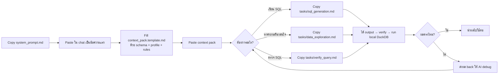

# Prompt Templates

> **เป้าหมาย:** ลดเวลาที่นักวิเคราะห์ในสำนัก ฯ ใช้ไปกับการ phrase prompt ทุกครั้งที่จะคุยกับ AI
> และให้ทุกคนใช้ standard เดียวกัน — output คุณภาพคงที่, audit ได้, แบ่งกันแก้ไขได้

---

## โครงสร้าง

```
prompts/
├── system_prompt.md           ← วางทุก session (ก่อน task อื่น ๆ)
├── context_pack.template.md   ← copy แล้ว fill schema/profile/rules
└── tasks/
    ├── sql_generation.md      ← ขอ SQL
    ├── data_exploration.md    ← ขอ ideas
    └── verify_query.md        ← ตรวจ SQL ก่อนรัน
```

---

## ลำดับการใช้งาน (Workflow)



---

## ตัวอย่าง Session ที่ดี

```text
[คุณ]      → paste system_prompt.md
[AI]       → "เข้าใจแล้ว พร้อมช่วยวิเคราะห์ครับ"
[คุณ]      → paste context_pack ที่ fill แล้ว
[AI]       → "ได้รับ schema 26 คอลัมน์ 14,661 แถว ถามอะไรได้เลย"
[คุณ]      → paste tasks/sql_generation.md + คำถาม
[AI]       → ส่ง SQL + assumptions + verification steps
[คุณ]      → paste tasks/verify_query.md + SQL ที่ได้
[AI]       → checklist + fix ถ้ามี
[คุณ]      → รัน SQL บน DuckDB local
[คุณ]      → "ผลออกมาเป็น X — ตีความให้หน่อย"
[AI]       → ตีความ + เสนอ next analyses
```

---

## หลักการสำคัญ

### ✅ Do

- **Version control prompts** — commit ลง repo แล้วทำ PR เมื่อปรับปรุง
- **Review ทุก 6 เดือน** — ดู Anthropic / OpenAI changelog แล้วปรับ prompt ถ้า model behavior เปลี่ยน
- **Add task templates ใหม่** เมื่อเจอ workflow ที่ทำซ้ำ ≥ 3 ครั้ง
- **Refine ผ่าน PR** — ถ้าเจอว่า AI ทำงานพลาด ระบุ commit message ว่ามาจาก incident อะไร

### ❌ Don't

- **ผูก prompt กับ model specific** (เช่น "ใน Claude 3.5...") — model จะเปลี่ยน prompt จะ outdated
- **เก็บ prompt ใน chat history เท่านั้น** — หายเมื่อ session หมด
- **fill context pack ด้วยข้อมูลจริง row-level** — ใช้เฉพาะ outputs จาก pipeline เท่านั้น

---

## Maintainer Checklist

ทุกครั้งที่แก้ prompt:

- [ ] PR description ระบุว่ามาจาก incident/feedback อะไร
- [ ] รัน prompt ใหม่กับ task เดิมเทียบกับ baseline
- [ ] ถ้าเพิ่ม task template ใหม่ — update diagram ใน README นี้
- [ ] ถ้าเปลี่ยน column convention — sync กับ `docs/glossary.md`
